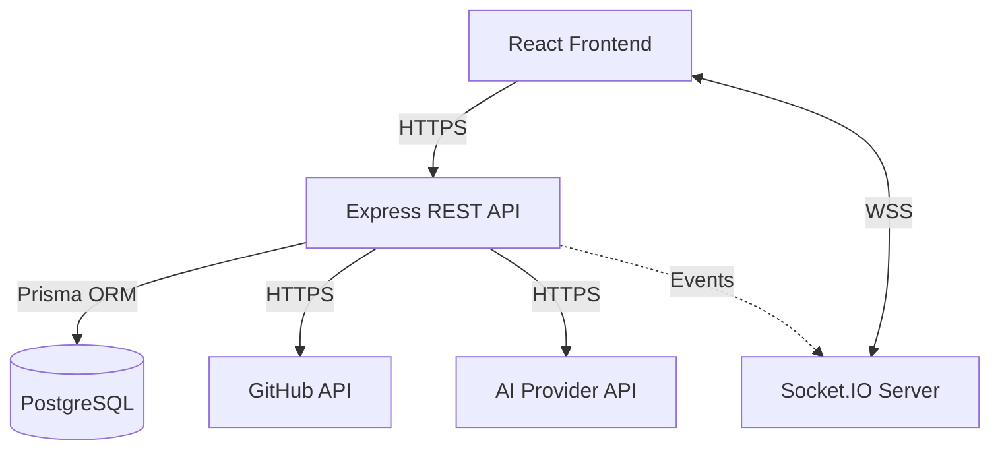
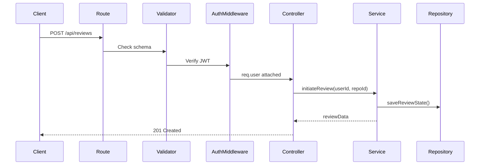
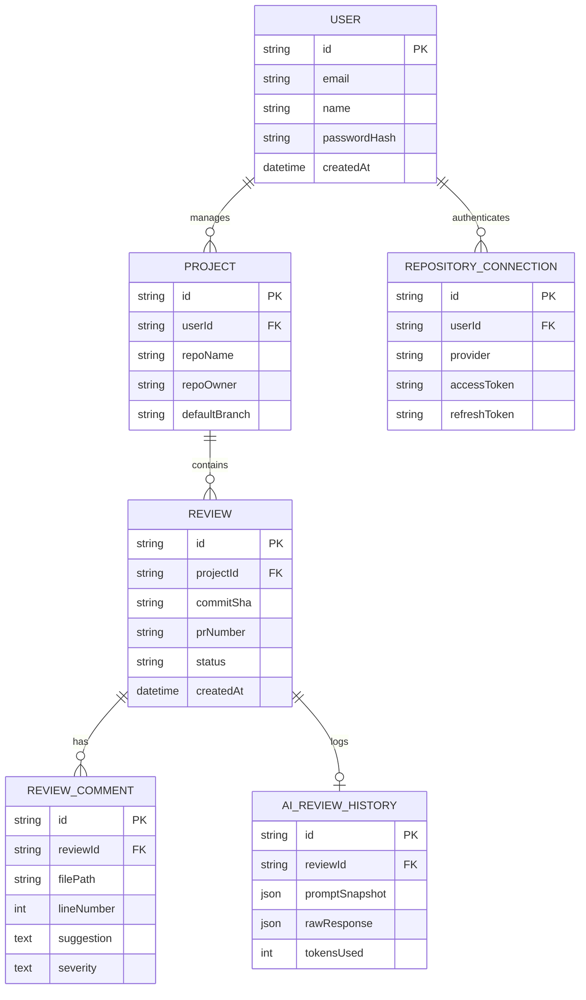
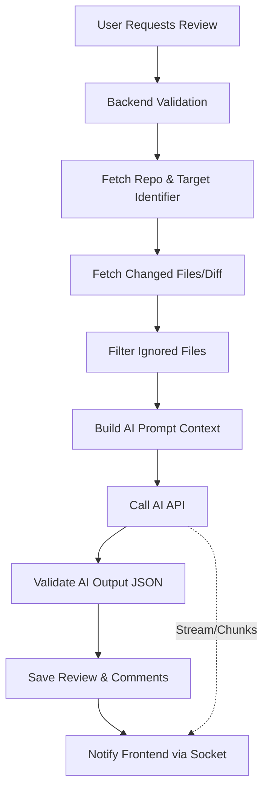

# Real-Time AI Code Reviewer: Backend Architecture Blueprint

## Phase 1 — System Architecture

### High-Level Architecture
The system follows a modular, layered architecture pattern designed for separation of concerns and future scalability. The backend serves as the secure orchestrator, ensuring the frontend never directly accesses sensitive APIs, databases, or AI models. 



### Request Lifecycle
1. **Client Request**: The frontend makes an HTTP request.
2. **Middleware**: Global middleware handles CORS, parsing, rate limiting, and security headers. Route-specific middleware handles authentication (JWT validation) and input validation.
3. **Controller**: Extracts parameters and passes them to the Service layer.
4. **Service**: Executes core business logic.
5. **Integration Modules / Repositories**: The Service interacts with Repositories (for DB access) or Modules (AI/GitHub APIs).
6. **Response**: The Service returns data to the Controller, which formats the HTTP response for the Client.

### Backend Responsibilities
- **Secure Orchestration**: Validate and authorize all requests.
- **Workflow Automation**: Manage the complete code review pipeline (fetch code -> analyze -> store -> notify).
- **State Management**: Persist user data, projects, and review history.
- **Real-Time Communication**: Push updates to clients asynchronously without polling.

> **Key Decisions & Rationale**: Choosing a monolithic layered architecture over microservices for the initial build reduces operational complexity while keeping the codebase modular enough to split later if necessary. 

---

## Phase 2 — Project Structure

A Domain-Driven Design (lite) and feature-based structure ensures scalability and maintainability.

```text
src/
├── config/           # Environment variables, constants, AI provider configs
├── middlewares/      # Global error handlers, auth guards, rate limiters
├── modules/          # External integrations (AI, GitHub, Socket.io)
│   ├── ai/
│   ├── github/
│   └── socket/
├── components/       # Feature-based domains
│   ├── auth/         # Routes, controllers, services, validations for Auth
│   ├── users/
│   ├── projects/
│   └── reviews/
├── repositories/     # Database access layer (Prisma wrappers)
├── utils/            # Helper functions (logging, formatting)
├── app.js            # Express app setup
└── server.js         # Entry point, HTTP & Socket server initialization
```

### Folder Explanations
* **`config/`**: Centralized configuration. Never store secrets here directly; load them from `.env`.
* **`middlewares/`**: Reusable request interceptors. Only HTTP-specific logic belongs here.
* **`modules/`**: Wrappers for external APIs. Contains the exact logic to communicate with Gemini/Claude/GitHub. Business logic should not leak into this folder.
* **`components/`**: Feature modules. Each component has its own `routes.js`, `controller.js`, `service.js`, and `validator.js`. This prevents "fat" folders and keeps features encapsulated.
* **`repositories/`**: Abstracts Prisma ORM. Keeps the service layer database-agnostic.

> **Key Decisions & Rationale**: A feature-based folder structure (`components/`) is chosen over a layer-based structure (`controllers/`, `services/`) because it scales better as the team and codebase grow.

---

## Phase 3 — Backend Layers

### Responsibilities
* **Routes**: Maps HTTP verbs and endpoints to specific controllers. Applies route-level middleware.
* **Controllers**: Handles HTTP request/response objects. Extracts data, calls the Service, and returns standardized JSON. Does *not* contain business logic.
* **Services**: The "brain" of the application. Orchestrates operations across Repositories and Modules. 
* **Repositories**: The only layer allowed to import and use Prisma. Executes CRUD operations.
* **Models**: Managed via `schema.prisma`. 
* **Middleware**: Intercepts requests for cross-cutting concerns (auth, logging, error handling).
* **Validators**: Uses Zod or Joi to validate incoming request bodies/queries before they reach the controller.
* **Modules (AI/GitHub/Socket)**: Facades for complex external systems.
* **Jobs/Prompts**: Future-proof directories for cron jobs and centralized AI prompt templates.

### Request Flow


> **Key Decisions & Rationale**: Strict separation prevents controllers from becoming bloated and makes the Service layer easily testable in isolation.

---

## Phase 4 — Database Design



### Table Details
* **Users**: Stores application users. Index on `email`.
* **Repository Connections**: Stores OAuth tokens for GitHub. Must be encrypted at rest. Index on `userId`.
* **Projects**: Represents a connected GitHub repo. Index on `userId`, `repoName`.
* **Reviews**: Core entity tracking a single review event (commit or PR). Index on `projectId`, `status`.
* **Review Comments**: Granular AI feedback items. Index on `reviewId`, `filePath`.
* **AI Review History**: Audit log for AI interactions. Useful for debugging and billing. Index on `reviewId`.

> **Key Decisions & Rationale**: Separating `Reviews` from `Review Comments` allows the frontend to stream comments incrementally. `AI Review History` provides essential observability for AI cost tracking and prompt debugging.

---

## Phase 5 — API Design

### Authentication Module
| Method | Route | Purpose | Body | Auth Required |
|---|---|---|---|---|
| POST | `/api/auth/register` | Create account | `{ email, password, name }` | No |
| POST | `/api/auth/login` | Authenticate user | `{ email, password }` | No |
| POST | `/api/auth/github` | Handle OAuth callback | `{ code }` | Yes |

### Projects Module
| Method | Route | Purpose | Body | Auth Required |
|---|---|---|---|---|
| GET | `/api/projects` | List user projects | None | Yes |
| POST | `/api/projects` | Connect a new repo | `{ repoOwner, repoName }` | Yes |
| GET | `/api/projects/:id` | Get project details | None | Yes |

### Reviews Module
| Method | Route | Purpose | Body | Auth Required |
|---|---|---|---|---|
| POST | `/api/reviews` | Request new review | `{ projectId, type, identifier }` | Yes |
| GET | `/api/reviews/:id` | Get review status | None | Yes |
| GET | `/api/reviews/:id/comments`| Get parsed feedback | None | Yes |

### Webhooks Module
| Method | Route | Purpose | Body | Auth Required |
|---|---|---|---|---|
| POST | `/api/webhooks/github` | Handle PR/push events | GitHub Payload | HMAC Sig |

> **Key Decisions & Rationale**: RESTful conventions provide predictability. The GitHub webhook route uses HMAC signature verification instead of JWT for authentication.

---

## Phase 6 — Review Engine Design

The Review Engine is an asynchronous pipeline orchestrated by the Service layer.



### Steps Explained
1. **User requests review**: HTTP POST triggers the pipeline.
2. **Backend validation**: Check repo access and API rate limits.
3. **Fetch changed files**: Call GitHub API to get the Git diff for the commit/PR.
4. **Generate Git diff**: Clean the diff (remove massive lockfiles, images, etc.).
5. **Build AI prompt**: Inject the clean diff into the templated system prompt.
6. **Call AI**: Send to Gemini/Claude.
7. **Validate output**: Ensure the AI returned structured JSON matching the expected schema.
8. **Save review**: Persist comments to PostgreSQL.
9. **Notify frontend**: Emit `review_complete` via Socket.IO.

> **Key Decisions & Rationale**: Treating the review process as a multi-step pipeline allows us to easily inject background workers (like BullMQ) later without rewriting the logic.

---

## Phase 7 — AI Module

### Responsibilities
* **Prompt Generation**: Uses Handlebars or JS template literals to build dynamic prompts containing the Git diff and review rules.
* **Structured JSON Output**: Forces the model to return a specific JSON schema (e.g., array of `{ file, line, suggestion, severity }`).
* **Retries & Validation**: Uses Zod to parse AI output. If the AI hallucinates bad JSON, the module automatically retries up to 2 times.
* **Token Optimization**: Truncates massive diffs and ignores non-code files to prevent exceeding token limits.
* **Context Management**: Can supply previous review comments as context for iterative reviews.
* **Rate Limiting**: Implements a bottleneck/queue for outgoing AI requests to respect provider quotas.

> **Key Decisions & Rationale**: AI outputs are inherently unpredictable. Wrapping the AI call in a robust validation and retry loop is critical for a stable production system.

---

## Phase 8 — GitHub Module

### Responsibilities
* **Repository Fetching**: Validates repository existence and permissions.
* **Commit/PR Retrieval**: Fetches metadata and raw diffs.
* **OAuth Flow**: Manages the exchange of OAuth codes for user access tokens.
* **API Limits**: Monitors the `x-ratelimit-remaining` header and gracefully degrades or queues requests.
* **Caching Strategy**: Caches static repository metadata (like default branch) using in-memory caching to save API calls.

> **Key Decisions & Rationale**: Centralizing all GitHub interactions ensures we have a single place to handle token rotation and rate limit backoffs.

---

## Phase 9 — Real-Time Architecture

### Socket.IO Integration
* **Connection Lifecycle**: Client connects with a JWT. Middleware validates the token before accepting the connection.
* **Room Management**: 
  * Users join a private room: `user:{userId}`.
  * When viewing a specific project, they join: `project:{projectId}`.
* **Review Progress Updates**: As the Review Engine processes files, it emits `review_progress` (e.g., "Analyzing auth.js...").
* **Completion Events**: Emits `review_complete` with the final payload ID.
* **Error Events**: Emits `review_error` if the AI API fails or GitHub is unreachable.
* **Scalability**: Designed to be compatible with `socket.io-redis-adapter` for multi-server scaling in the future.

> **Key Decisions & Rationale**: Using rooms ensures that updates are only broadcast to the authorized user viewing the specific project, preventing data leakage.

---

## Phase 10 — Security

* **JWT**: Short-lived access tokens (15m) and HTTP-only, secure cookies for refresh tokens (7d).
* **Password Hashing**: Argon2 or bcrypt for local auth.
* **Rate Limiting**: Strict limits on `/api/reviews` (e.g., 10 per hour) and `/api/auth` (e.g., 5 per minute) using `express-rate-limit`.
* **Helmet & CORS**: Strict CORS origin configuration. Helmet for setting secure HTTP headers.
* **Input Validation**: All incoming data validated via Zod to prevent NoSQL/SQL injections.
* **Prompt Injection Mitigation**: Sanitize Git diff inputs. Instruct the AI system prompt to ignore user commands found within the code diff.
* **Secrets Management**: GitHub OAuth tokens must be encrypted in the database using a robust cipher (AES-256-GCM).

> **Key Decisions & Rationale**: Encrypting third-party tokens at rest and mitigating prompt injection are critical for an AI-powered developer tool dealing with proprietary code.

---

## Phase 11 — Error Handling

### Strategy
1. **Custom `AppError` Class**: Extends the built-in `Error` with `statusCode` and `isOperational` flags.
2. **Global Error Middleware**: Catches all unhandled errors. If `isOperational` is true, sends a clean message to the client. If false (programming error), logs the stack trace and sends a generic 500 error.
3. **Async Wrappers**: Wraps all controller functions in a `catchAsync` utility to eliminate `try/catch` boilerplate.
4. **Retry Strategy**: Implements exponential backoff for external API calls (AI, GitHub).
5. **HTTP Status Codes**: Strict adherence to standards (400 Bad Request, 401 Unauthorized, 403 Forbidden, 404 Not Found, 429 Too Many Requests).

> **Key Decisions & Rationale**: A centralized error handler prevents server crashes, ensures consistent API responses, and prevents stack traces from leaking to the client.

---

## Phase 12 — Logging & Monitoring

* **Logging Library**: Winston or Pino for structured, high-performance JSON logging.
* **Audit Logs**: Critical actions (login, repo connect, review requested) are logged with user context.
* **AI Request Metrics**: Log token usage, latency, and provider ID for cost analysis.
* **Health Checks**: `/health` endpoint validating DB connectivity and external API reachability.
* **Monitoring**: Prepared for integration with Datadog or Prometheus via standard Node.js metric exporters.

> **Key Decisions & Rationale**: Structured JSON logging allows logs to be easily ingested and queried by modern APM tools.

---

## Phase 13 — Development Roadmap

### Milestone 1: Foundation & Auth
* **Objective**: Setup project, DB, and user authentication.
* **Features**: Express server, Prisma setup, JWT Auth flow.
* **Deliverables**: Working REST API capable of registering and logging in users.
* **Testing goals**: 100% coverage on Auth flows.

### Milestone 2: GitHub Integration
* **Objective**: Connect repositories and fetch code.
* **Features**: GitHub OAuth, fetch repo lists, fetch commit diffs.
* **Deliverables**: Endpoints to link a GitHub account and retrieve raw code diffs.
* **Testing goals**: Mock GitHub API and test parsing logic.

### Milestone 3: The AI Engine
* **Objective**: Generate code reviews.
* **Features**: Prompt engineering, AI module integration, JSON validation.
* **Deliverables**: A synchronous endpoint that takes a commit SHA, talks to the AI, and returns structured feedback.
* **Testing goals**: Robustness against invalid AI JSON responses.

### Milestone 4: Real-Time & Persistence
* **Objective**: Store reviews and stream updates.
* **Features**: PostgreSQL schema for reviews, Socket.IO setup.
* **Deliverables**: Asynchronous review pipeline with real-time progress updates to the frontend.
* **Testing goals**: E2E tests for socket connection and event emission.

### Milestone 5: Production Readiness
* **Objective**: Security, error handling, and deployment.
* **Features**: Global error handlers, rate limiting, token encryption, logging.
* **Deliverables**: A hardened, production-ready backend.
* **Testing goals**: Load testing and penetration testing.

> **Key Decisions & Rationale**: Building incrementally from Auth to GitHub to AI ensures each major integration is isolated and tested before combining them into the complex Real-Time Engine.

---

## Phase 14 — Future Scalability

To support thousands of concurrent developers:
* **Message Queues**: Replace in-memory async tasks with **BullMQ** or RabbitMQ. Review requests are pushed to a queue and processed by background worker nodes.
* **Redis Caching**: Cache GitHub API responses and AI prompt templates in Redis to reduce latency and API rate limiting.
* **Microservices**: Split the "AI Review Engine" into a separate Python or Node service optimized for heavy networking and compute.
* **Multiple AI Providers**: Abstract the AI module to route requests to OpenAI, Gemini, or Claude based on availability, rate limits, or cost.
* **Event-Driven Webhooks**: Fully rely on GitHub webhooks to trigger background reviews automatically when a PR is opened, rather than requiring user clicks.

> **Key Decisions & Rationale**: The current layered architecture makes it extremely easy to extract the Service layer into a background queue processor when horizontal scaling is required.
